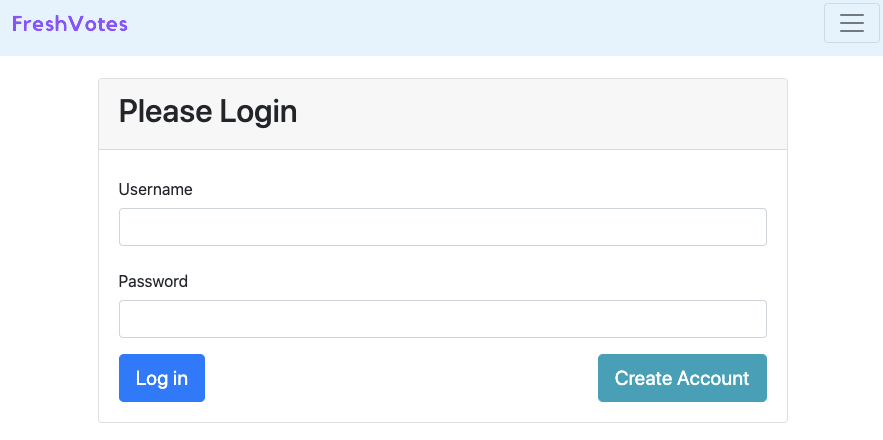
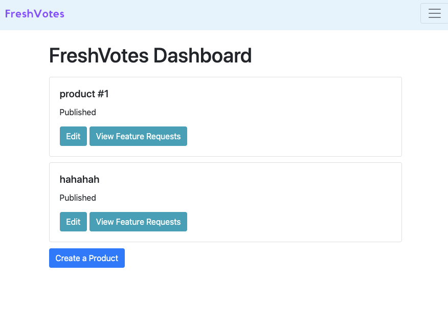
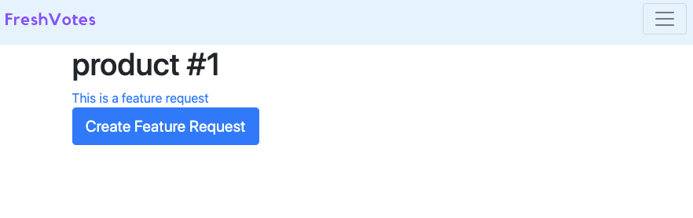
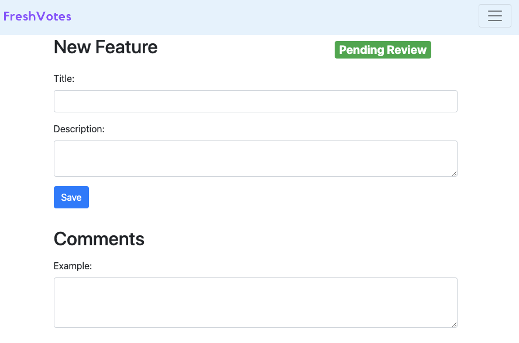

A Web Application allows developers to conduct polls of their products and services. 

Thanks to this tutorial: https://www.youtube.com/playlist?list=PL2OrQJM8zmZ0k-S5FfR2qrwgupnaINO0m

A preview of this application. 

Log in page:

Dashboard:

Feature Page:

Create New Feature:

