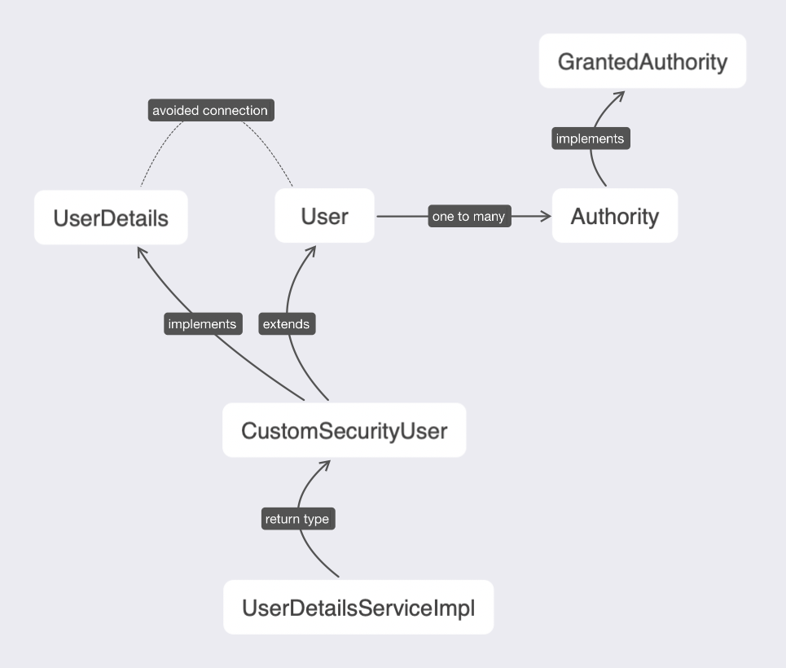

## Reference

[How to build a basic Spring Application with IntelliJ](https://www.youtube.com/watch?v=tgR-vBuLd0Y)

[What's a maven artifact?](https://stackoverflow.com/questions/2487485/what-is-a-maven-artifact)

[What's an entity in Java?](https://docs.oracle.com/javaee/6/tutorial/doc/bnbqa.html)

[What's JPA?](https://www.youtube.com/watch?v=WZLTwbeENGs)

[What's Embeddable in Java Annotation?](https://stackoverflow.com/questions/21143707/what-is-difference-between-entity-and-embeddable)

[Why composite-id class must implement Serializable?](https://stackoverflow.com/questions/9271835/why-composite-id-class-must-implement-serializable)

[Authentication vs. Authorization](https://medium.com/datadriveninvestor/authentication-vs-authorization-716fea914d55)

[What's a Java Bean and Serializable?](https://stackoverflow.com/questions/3295496/what-is-a-javabean-exactly)


What's CSRF? https://www.youtube.com/watch?v=m0EHlfTgGUU

Cross Site Request Forgery. It should be avoided by some methods. 


[How to use Spring Security for CSRF protection?](https://docs.spring.io/spring-security/site/docs/3.2.0.CI-SNAPSHOT/reference/html/csrf.html)


```
username:
zghbdhm@icloud.com

password: asdf
```


## Database Design

Vote

1. upvote
2. User_id
3. 


Users

1. id
2. username
3. password
4. name


Comment 

1. text


Feature 

1. title 
2. description
3. status


上次看到这个：

https://www.youtube.com/watch?v=ohbQYiDXRuY&list=PL2OrQJM8zmZ0k-S5FfR2qrwgupnaINO0m&index=4


# Video Notes


## FreshVotes 13 - Adding Password Encoder

First 3 mins is very good. 

https://www.youtube.com/watch?v=qr14n0tTtmE


**Bcrypt** is an algorithm designed to encrypt password. 

If the input string and number of rounds are fixed, the output string is fixed. 

It's a one way process. 

```
plain text --Bcrypt--> encoded text (yes)
encoded text -- No way --> plain text (no)
```

Use this link to play around the Bcrypt. 

https://bcrypt-generator.com/


## FreshVotes 15 - Leveraging a Database for Users

**Controller** 

**Service** 

**Repository**

Three important components. 


## FreshVotes 16 - Implementing User Details

这一节课最重要的是搞清楚三个 class 之间的关系

`CustomSecurityUser` , `Authority` , `User`

为什么不直接使用 `User` 继承 `org.springframework.security.core.userdetails.UserDetails` . 是因为避免使得我们自己的 class 和 `Spring Security` 的 class 高度嵌合.

Authority 是另外的一个 `Entity` , 用来存储相关信息的





- `Authority` and `User` are two entities. 
- `User` is the parent of `CustomSecurityUser`. 
- `CustomSecurityUser` implements `UserDetails`. 
- `UserDetails` is needed for `UserDetailsServiceImpl`, which implements `org.springframework.security.core.userdetails.UserDetailsService`


## FreshVotes 17 - Logging into FreshVotes

Encoder and decoder

Password should never be stored in plaintext.


## FreshVotes 19 - Creating a Registration Page Part II

How to use `thymeleaf` and `@ModelAttribute` to transmit data between html and Java. 

`csrf` token should be used in all methods except for `get`. 

Add a form in `register.html` . 


## FreshVotes 20 - Creating a Registration Page Part III

Use `UserRepository` and `UserService` to save a new registered user information. 

```
John Doe mh3994@cloumbia.edu 
password: 112233
```


## FreshVotes 21


## FreshVotes 26 - Creating Product Controller

```
database action | HTTP method
-----------------------------
create	=	POST
read 		=	GET
update 	=	PUT
delete	=	DELETE
```


 


